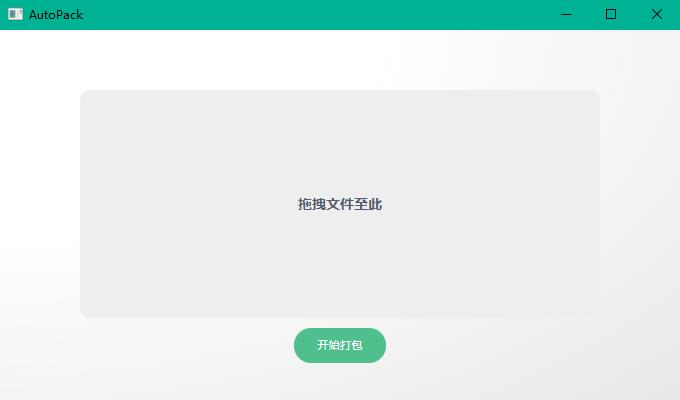

# AutoPack
拖拽项目，自动将源文件和可执行文件分别进行压缩打包备份。同时将旧版本的可执行文件重命名，增加时间戳。

# 环境 
* **Node 14.17.5** *

# 构建
* **1.npm install** *
* **2.npm run dev** *

# Node版本引起的常见问题
[解决方法](https://github.com/SimulatedGREG/electron-vue/issues/871)

# 界面预览

